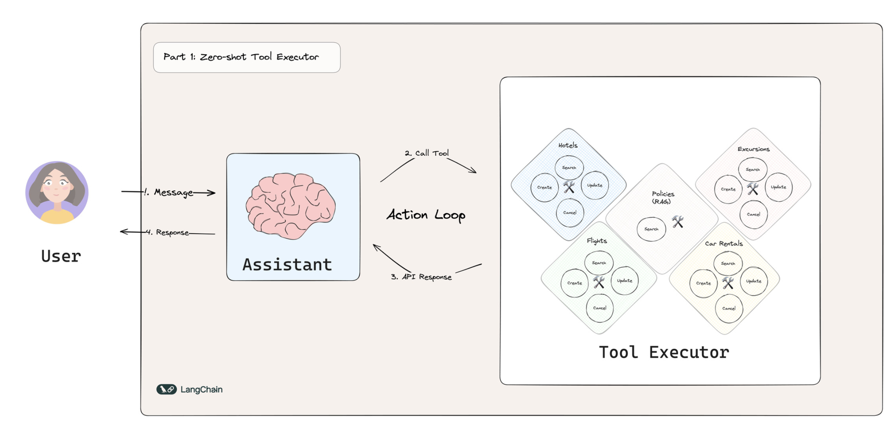
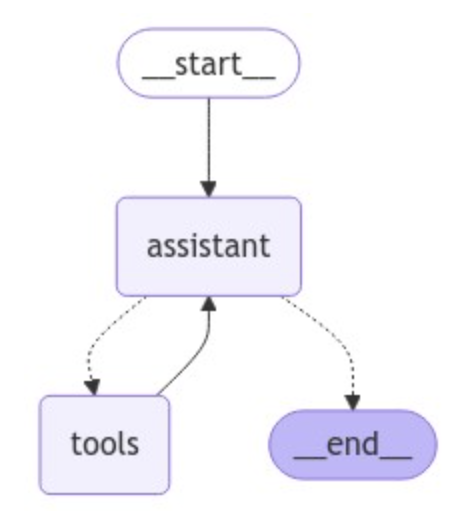
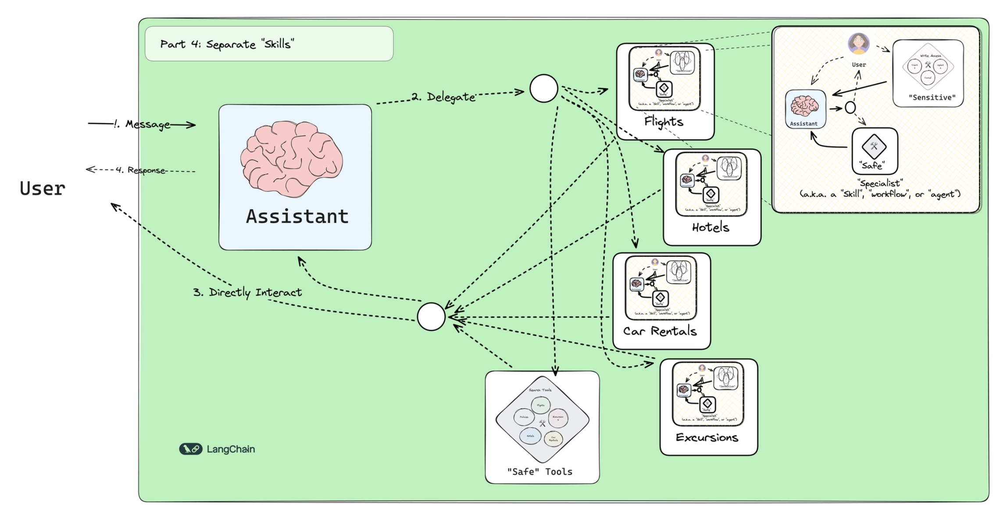
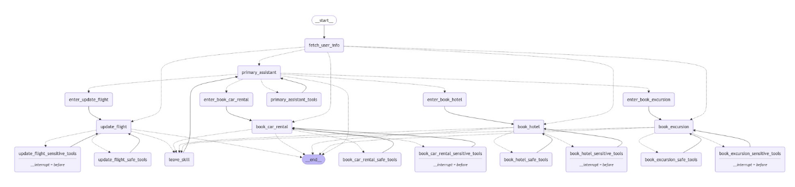

# Customer Support Bot for Travelers ✈️

This is a customer support bot designed to assist travelers with their enquiries and issues. It can handle a variety
of topics related to travel, such as new bookings, booking changes, and general enquiries.

This repository is based on the [LangGraph tutorial](https://langchain-ai.github.io/langgraph/tutorials/customer-support/customer-support/) 
and is designed as a playground for building customer support bots for travelers.

The repository includes two main approaches to building the bot:
- **Zero Shot Approach:** This approach uses a single primary agent that handles all user requests and relies on 
tools to execute specific tasks (e.g. searching for flight options, updating existing bookings, etc.).


- **Specialised Workflows Approach:** This approach uses a primary agent that routes requests to specialised workflows.
The primary agent is responsible for understanding user intent and collecting necessary information required by the 
specialised workflows. Each specialised workflow is designed to handle a specific domain of requests and is connected 
to a set of tools to execute the tasks. This approach allows for more extensible design compared to the zero shot 
approach, especially when the bot needs to handle a wide range of topics and requests and the number of tools starts to grow.

## Zero-Shot Approach
<p align="center">

</p>
The zero-shot approach uses a single primary agent that handles all user requests. 
The primary agent is designed to tackle all types of requests without the need for specialised workflows. It uses a 
set of tools to execute specific tasks, such as searching for flight options, updating existing bookings, etc.
The overall design is simpler and more straightforward, but it becomes less manageable as the number of tools grows.
The latter could also lead to a decrease in performance, as the agent may struggle to handle a wide range of requests effectively.

The simple 2-node graph looks like the following:
<p align="center">

</p>


## Specialised Workflows Approach
<p align="center">

</p>

The specialised workflows approach tries to address the limitations of the zero-shot approach by introducing a primary 
agent that routes requests to specialised workflows. Each specialised workflows is made available as a tool to the 
primary agent. This is implemented through the definition of a set of pydantic models that define the parameters to be 
collected for each workflow.

Example of pydantic model for a specialised workflow:

```python
class ToBookCarRental(BaseModel):
    """Transfers work to a specialized assistant to handle car rental bookings."""

    location: str = Field(
        description="The location where the user wants to rent a car."
    )
    start_date: str = Field(description="The start date of the car rental.")
    end_date: str = Field(description="The end date of the car rental.")
    request: str = Field(
        description="Any additional information or requests from the user regarding the car rental."
    )

    class Config:
        json_schema_extra = {
            "example": {
                "location": "Basel",
                "start_date": "2023-07-01",
                "end_date": "2023-07-05",
                "request": "I need a compact car with automatic transmission.",
            }
        }
```

Each specialised workflow is designed to handle a specific type of request and can be extended or modified as needed.
Each workflow is connected to a set of tools that execute the tasks required to fulfill the request. As part of the tools,
the CompleteOrEscalate tool is made available to each specialised workflow and used to route back to the primary agent 
if the specialised workflow has fulfilled the request or if it cannot handle the request and needs to escalate it back 
to the primary agent for further assistance.

Whenever the conversation is handed over to a specialised workflow, the dialog state is updated to reflect the current
workflow being executed. This allows to resume the conversation from the specialised workflow if needed. If the 
conversation is handed back to the primary agent, the dialog state is reset to the primary agent.

The resulting graph is more complex than the zero-shot approach:
<p align="center">

</p>

## Resources
[LangGraph tutorial](https://langchain-ai.github.io/langgraph/tutorials/customer-support/customer-support/) 
